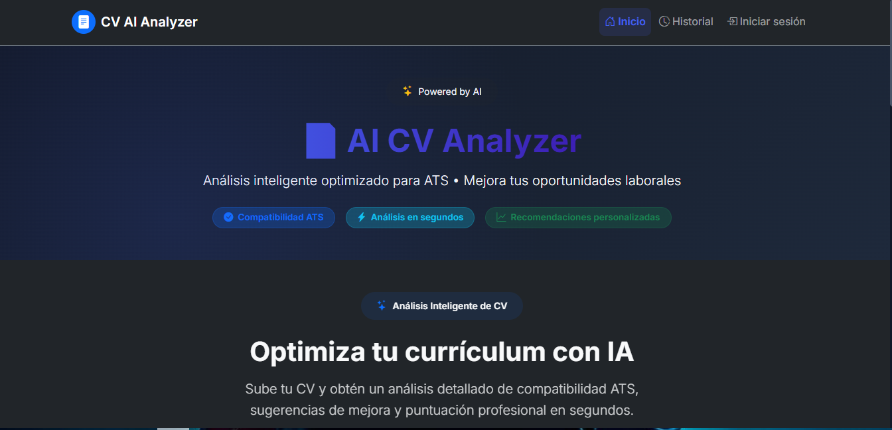
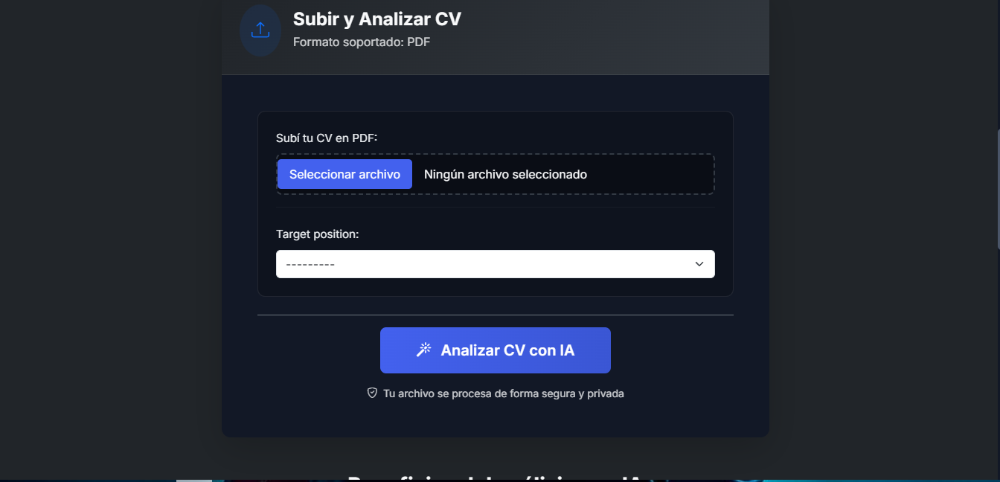
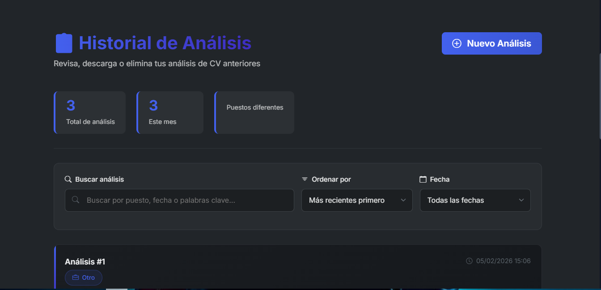
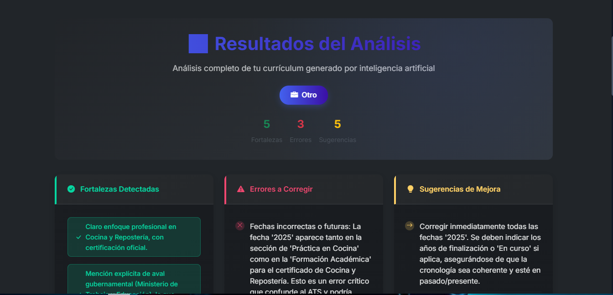
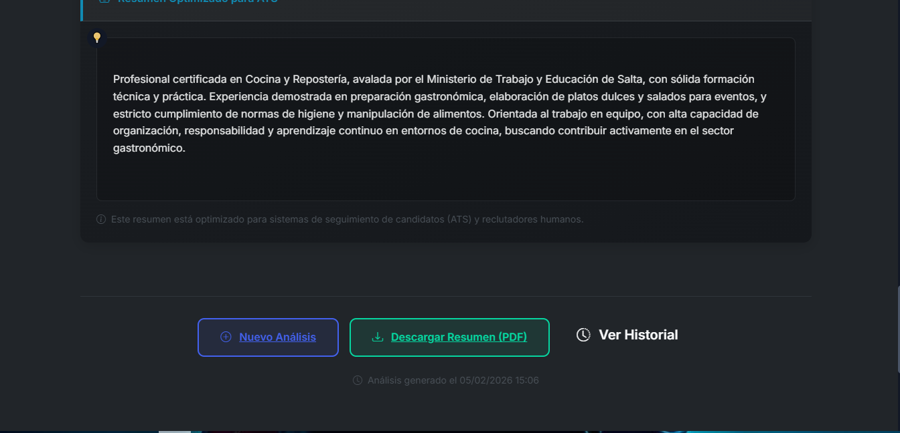

# 🤖 AI CV Analyzer – Análisis Inteligente de Currículums


---

## 📌 Descripción

**AI CV Analyzer** es una **aplicación web desarrollada con Django** que permite analizar currículums en formato PDF utilizando **Inteligencia Artificial (Google Gemini)**.

La aplicación simula el criterio de un **reclutador técnico senior**, evaluando el CV según un puesto objetivo y devolviendo un análisis estructurado que incluye:

* Fortalezas del perfil
* Errores o debilidades detectadas
* Sugerencias de mejora
* Un resumen profesional optimizado para ATS

Está pensada para **personas que buscan trabajo**, **reclutadores** y **desarrolladores** que deseen mejorar la calidad y claridad de un CV de forma automática e inteligente.

---

## 🚀 Tecnologías utilizadas

- **Lenguaje:** Python 3.12+
- **Framework:** Django 4.2+
- **Base de datos:** SQLite3 (`db.sqlite3`) por defecto  
  *(puede reemplazarse fácilmente por PostgreSQL, MySQL u otra base soportada por Django)*
- **IA Generativa:** Google Gemini API (gemini-1.5-flash)
- **Frontend:** HTML5 + CSS3 (Templates Django)
- **Gestión de estilos:** Archivos estáticos (`analyzer/static/css` y `analyzer/static/js`)
- **Gestión de variables de entorno:** django-environ (.env)
- **Procesamiento de PDFs:** PyPDF2
- **Exportación de reportes:** ReportLab (PDF)
- **Buenas prácticas:** Código limpio, separación de responsabilidades


---

## ⚙️ Funcionalidades

✅ Carga de CV en formato PDF  
✅ Selección de puesto objetivo  
✅ Análisis inteligente mediante IA (Gemini)  
✅ Resultados estructurados en:

* Fortalezas
* Errores
* Sugerencias
* Resumen optimizado 

✅ Historial de análisis realizados  
✅ Visualización de análisis anteriores  
✅ Eliminación de análisis desde el historial  
✅ Descarga del resumen optimizado en PDF  
✅ Interfaz clara con soporte para modo dark  

---

## 🛠️ Instalación y configuración (modo desarrollo)

### 1️⃣ Clonar el repositorio

```bash
git clone https://github.com/solanomillo/AI_CV_Analyzer.git
cd AI_CV_Analyzer
```

### 2️⃣ Crear y activar entorno virtual

```bash
python -m venv env
env\Scripts\activate      # Windows
source env/bin/activate   # Linux / Mac
```

### 3️⃣ Instalar dependencias

```bash
pip install -r requirements.txt
```

### 4️⃣ Configurar variables de entorno

Crear un archivo `.env` en la raíz del proyecto:

```bash
GEMINI_API_KEY=tu_api_key_aqui
GEMINI_MODELO_FLASH=gemini-2.5-flash
DEBUG=True
```

### ▶️ Ejecutar la aplicación

```bash
python manage.py migrate
python manage.py runserver
```

Abrí el navegador en: `http://127.0.0.1:8000/`

---

## 📂 Estructura del proyecto

```bash
AI_CV_ANALYZER/
│
├── analyzer/
│   ├── services/
│   │   └── cv_agent.py        # Agente de análisis con IA
│   ├── static/
│   │   ├── css/               # Estilos CSS
│   │   └── js/                # Scripts JS
│   ├── templates/
│   │   ├── base.html          # Template base
│   │   ├── home.html          # Carga de CV
│   │   ├── result.html        # Resultado del análisis
│   │   └── history.html       # Historial de análisis
│   ├── views.py
│   ├── models.py
│   ├── forms.py
│   └── urls.py
│
├── media/                     # CVs subidos
├── screenshots/               # Capturas de la app
├── .env                       # Variables de entorno (NO versionado)
├── requirements.txt
├── manage.py
├── .gitignore
└── README.md
```

---

## 🔐 Seguridad

✔️ API Key protegida mediante variables de entorno  
✔️ `.env` excluido del repositorio  
✔️ Sin credenciales hardcodeadas  
✔️ Manejo controlado de errores de IA  
✔️ Buenas prácticas para proyectos productivos

---

## 🧠 Arquitectura del análisis con IA

1. El usuario sube un CV en PDF
2. Se extrae el texto con PyPDF2
3. Se construye un prompt estricto orientado a JSON
4. Gemini genera el análisis
5. La respuesta se valida y normaliza
6. El resultado se persiste en la base de datos
7. Se muestra el análisis y se habilita su descarga

---
## 🖼️ Vista previa






## 👨‍💻 Autor

**Julio Solano**  
🔗 GitHub: [https://github.com/solanomillo](https://github.com/solanomillo)  
📧 Email: [solanomillo144@gmail.com](mailto:solanomillo144@gmail.com)

---

## 📄 Licencia

Este proyecto está bajo la licencia **MIT**.
Podés usarlo, modificarlo y compartirlo libremente.
